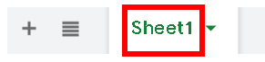
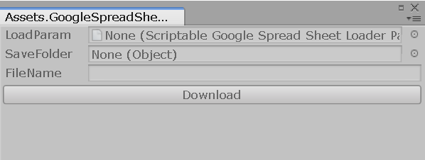

# GoogleSpreadSheetDownloaderForUnity

## このリポジトリは？

Unity エディター上でGoogle スプレッドシートをダウンロードするエディター拡張です。

## 使い方

### unitypackage をインストール

[GoogleSpreadSheetDownloaderForUnity/releases](https://github.com/R-Sudo/GoogleSpreadSheetDownloaderForUnity/releases) ページからunitypackage をダウンロード。
対象のUnity プロジェクトにインストールしてください。

### 依存ライブラリのインストール

以下のライブラリをプロジェクトにインストールしてください。

- UniTask
  - <https://github.com/Cysharp/UniTask>
- Utf8Json
  - <https://github.com/neuecc/Utf8Json>

### Google 側の設定

事前にいくつかの設定が必要になります。

#### API キーの作成

まずは、[Google Cloud Platform](https://console.developers.google.com/apis/credentials) ページからプロジェクトを作成します。  
次に、『認証情報』を作成します。
左のメニューの認証情報を選択、『認証情報を作成』を選択して『API キー』を選択することで作成されます。

#### 対象のスプレッドシートを公開する

ダウンロード対象のスプレッドシートのページの右上にある『共有』から公開してください。

### Google スプレッドシートのダウンロードパラメーターの設定

右クリックメニューから、  Create>ScriptableObject>GoogleSpreadSheetLoaderParam  
を選択して、
ダウンロードに使うスクリプタブルオブジェクトを作成してください。
作成後各パラメータを設定します。

#### Spread Sheet Id

スプレッドシート本体のID を設定します。  
ID は、以下の文字列を設定します。

`https://docs.google.com/spreadsheets/d/ここの文字列/edit#gid=`

#### Spread Sheet Name

ダウンロード対象のスプレッドシート名を設定します。  
(以下の画像例だと、『Sheet1』と設定します。)

#### Api Key

作成したAPI キーを設定します。

#### Range

取得範囲を絞りたい時に設定します。
設定しなくても構いません。

### ダウンロードをする

Unity のツールバーの、  
Window>GoogleSpreadSheetDownload  
からダウンロード用ウィンドウを開きます。

#### LoadParam

作成したスクリプタブルオブジェクトを設定します。

#### SaveFolder

保存先のフォルダーを設定します。

#### FileName

保存ファイル名を設定します。

#### 注意点

ダウンロード用ウィンドウはPlayMode 中でないと実行できません。

